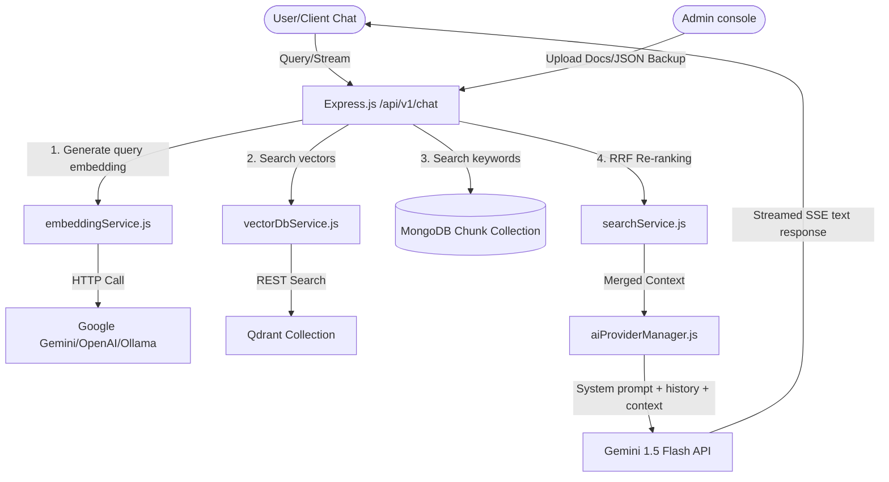

# Production-Ready AI RAG Chatbot Integration

This document outlines the architecture, setup, configuration, and API specifications for the integrated Retrieval-Augmented Generation (RAG) chatbot system added to your MERN application.

---

## 1. Architecture Overview

The system uses a highly modular service-oriented architecture, permitting seamless switches between AI providers and vector database drivers via environment configurations without codebase modifications.



---

## 2. Updated Project Folder Structure

```text
agency/
├── Dockerfile                  # Container definition for server deployment
├── docker-compose.yml          # Orchestrates server + MongoDB + Qdrant
├── README_AI.md                # This comprehensive documentation guide
├── server/
│   ├── config/
│   │   └── aiConfig.js         # Swappable configurations & environment manager
│   ├── middleware/
│   │   └── auth.js             # Shared JWT validation middleware
│   ├── models/
│   │   ├── Document.js         # Stores document registries and states
│   │   ├── Chunk.js            # Stores split text segments + lexical index
│   │   ├── Session.js          # Handles chat memories and citations list
│   │   └── UsageLog.js         # Gathers telemetry latency and token usage logs
│   ├── routes/
│   │   └── apiRouter.js        # Versioned routes (/chat, /upload, /health, /analytics)
│   ├── services/
│   │   ├── aiProviderManager.js# Bridges completions/SSE streams to LLMs
│   │   ├── embeddingService.js # Handles vector embedding translation calls
│   │   ├── vectorDbService.js  # Communicates with Qdrant (with mock fallback)
│   │   ├── textSplitter.js     # Splits texts using Recursive Character rules
│   │   ├── documentParser.js   # Extracts text from PDF, DOCX, TXT, MD
│   │   ├── ingestionService.js # Manages async background pipeline runs
│   │   ├── searchService.js    # Performs Hybrid search & RRF merging
│   │   └── seedKnowledgeBase.js# Indexing compiler for site FAQs and Projects
│   └── tests/
│       └── testRunner.js       # Automated assertions testing suite
└── src/
    ├── App.jsx                 # Mounted FloatingAIChat globally
    └── components/
        └── FloatingAIChat.jsx  # Modern glassmorphism floating chat overlay
```

---

## 3. Environment Variables Configuration

Create or update `server/.env` with the following variables:

```ini
# Server Setup
PORT=5000
MONGO_URI=mongodb://127.0.0.1:27017/amarix
JWT_SECRET=amarixSecretTokenKey2026!

# LLM Conversational Driver Setup
AI_PROVIDER=gemini              # Swappable: 'gemini' | 'openai' | 'ollama'
AI_MODEL=gemini-3.1-flash-lite  # Model to invoke (e.g., 'gemini-3.1-flash-lite', 'gpt-4o-mini', 'llama3')
GEMINI_API_KEY=AIzaSy...        # Required when AI_PROVIDER=gemini
OPENAI_API_KEY=sk-proj...        # Required when AI_PROVIDER=openai
OLLAMA_BASE_URL=http://localhost:11434

# Embedding Driver Setup
EMBEDDING_PROVIDER=gemini       # Swappable: 'gemini' | 'openai' | 'ollama'
EMBEDDING_MODEL=gemini-embedding-001 # e.g., 'gemini-embedding-001', 'text-embedding-3-small', 'nomic-embed-text'

# Vector Database Client Setup
VECTOR_DB=qdrant                # Driver: 'qdrant' (auto-falls back to mock if connection fails)
QDRANT_URL=http://localhost:6333
QDRANT_API_KEY=                 # If using Qdrant Cloud auth lines
QDRANT_COLLECTION=agency_knowledge_base

# RAG Splitting & Merging Controls
CHUNK_SIZE=800
CHUNK_OVERLAP=150
TOP_K=5
SIMILARITY_THRESHOLD=0.5
MAX_CONTEXT_SIZE=12000
STREAMING=true
UPLOAD_LIMIT_MB=10
```

---

## 4. API Endpoints Reference

### Public Interfaces

#### `POST /api/v1/chat`
Submit queries to the assistant.
* **Headers:** `Accept: text/event-stream` (to trigger SSE chunk stream), or standard `application/json`.
* **Payload:**
  ```json
  {
    "sessionId": "optional-uuid-string",
    "query": "What custom AI integrations do you deploy?",
    "stream": true
  }
  ```
* **SSE Stream Response Formats:**
  * Chunk delta text: `data: {"text": "Solutions include "}`
  * Terminal Done flag: `data: {"done": true, "sessionId": "UUID", "citations": [...]}`

#### `POST /api/v1/chat/sessions`
Generates a new persistent user conversation session.

---

### Administrative Interfaces (Secured via `Authorization: Bearer <JWT_Token>`)

#### `GET /api/v1/health`
Resolves statuses of Mongo, Qdrant, and active LLM keys.

#### `POST /api/v1/upload`
Accepts multi-part file payloads (PDF/DOCX/TXT/MD), validates them, and pushes them to background splitters.

#### `DELETE /api/v1/documents/:id`
Purges a document, its MongoDB chunks, and Qdrant vectors.

#### `POST /api/v1/reindex`
Wipes and rebuilds static data embeddings (FAQ catalog, services list, blog insights) and pulls latest projects.

#### `GET /api/v1/analytics/daily`
Exposes observability stats: request volumes, failure rates, storage MB, and latency distributions.

#### `GET /api/v1/backup/export` & `POST /api/v1/backup/import`
Dumps and restores knowledge base snapshots.

---

## 5. Swapping Drivers Guide

### How to Switch AI/Embedding Provider
1. Open `server/.env`.
2. To use OpenAI, modify:
   ```ini
   AI_PROVIDER=openai
   AI_MODEL=gpt-4o-mini
   EMBEDDING_PROVIDER=openai
   EMBEDDING_MODEL=text-embedding-3-small
   OPENAI_API_KEY=sk-...
   ```
3. Restart the Node server. The system automatically shifts all vector dimension calculations and completions loops.

### How to Switch Vector Database
* By default, setting `VECTOR_DB=qdrant` connects to Qdrant.
* If Qdrant is unavailable or unset, the system logs a warning and loads a Cosine-calculating local in-memory Mock database driver automatically, ensuring local developers can proceed without spinning up containers.

---

## 6. Development, Testing, and Deployment

### Setup Instructions (Local)
1. Navigate to the `server/` directory and run:
   ```bash
   npm install
   ```
2. Run the automated assertions test suite:
   ```bash
   npm run test
   ```
3. Boot up the server:
   ```bash
   npm start
   ```

### Docker Deployments
1. Spin up the whole infrastructure (Express server, MongoDB, and Qdrant DB) inside containers:
   ```bash
   docker compose up --build -d
   ```
2. Once online, visit the admin dashboard panel, navigate to the **Knowledge Base** section, and click **Re-index Site Data** to build the initial indexes.
